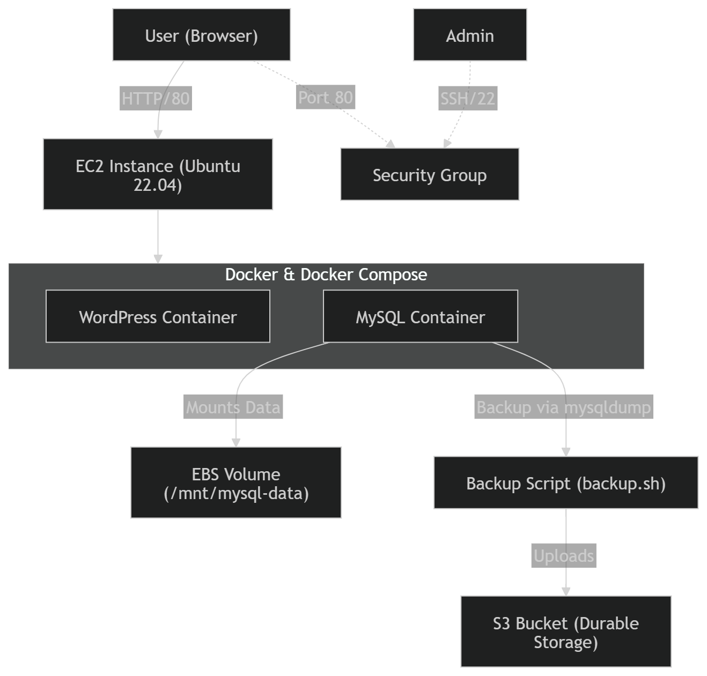

# Architecture Document

## 1. Overview

This project deploys a two-tier WordPress application on AWS using Docker containers running on a single EC2 instance. The goal of the deployment is to demonstrate infrastructure provisioning, container orchestration, persistent storage configuration, and automated database backups using AWS services.

The application consists of two containers: a WordPress frontend and a MySQL database backend. Docker Compose is used to define and manage the services. Persistent storage for the MySQL database is provided by an attached EBS volume to ensure data survives container restarts or instance reboots.

A backup script exports the MySQL database and uploads the backup file to an S3 bucket for durable storage.

---

## 2. System Architecture

The application follows a simple two-tier architecture:



Components:

User
A user accesses the WordPress site through a web browser using the public IP address of the EC2 instance.

EC2 Instance
An Ubuntu 22.04 server hosts Docker and Docker Compose. It acts as the compute environment for the application.

Docker / Docker Compose
Docker runs the WordPress and MySQL containers. Docker Compose defines the services, environment variables, networking, and storage configuration.

WordPress Container
Handles the web application and serves HTTP traffic on port 80.

MySQL Container
Stores WordPress application data such as posts, users, comments, and settings.

EBS Volume
Mounted to `/mnt/mysql-data` and mapped to the MySQL container to provide persistent database storage.

S3 Bucket
Stores timestamped database backups uploaded by the backup script.

---

## 3. Persistent Storage Strategy

The MySQL container stores its data on an attached EBS volume rather than inside the container filesystem.

Containers are designed to be ephemeral. If the MySQL container were shut down or recreated without external storage, all database data would be lost. By mapping the MySQL data directory to `/mnt/mysql-data` on the EBS volume, the database files persist independently of the container lifecycle.

Benefits of this approach:

- Database data survives container restarts
- Data persists if the container is recreated or damaged
- Storage can be managed independently from the container runtime
- Data can be moved across instances by attaching and detaching the EBS Volume.
- Backups can be generated directly from the stored database data

---

## 4. Security Configuration

The EC2 instance uses a security group configured with the following inbound rules:

Port 22 (SSH)
Allows remote administrative access to the instance.

Port 80 (HTTP)
Allows users to access the WordPress application via a web browser.

Both ports are currently open to `0.0.0.0/0`, meaning any IP address can access them.

Security considerations:

- Allowing SSH from all IPs increases exposure to brute-force attacks.
- In a production environment, SSH access should be restricted to specific trusted IP addresses.
- HTTPS should also be enabled to encrypt web traffic.

---

## 5. Backup Strategy

A bash script (`backup.sh`) is used to create a MySQL database backup.

The script performs the following actions:

1. Executes `mysqldump` inside the running MySQL container using `docker exec`.
2. Generates a timestamped SQL backup file.
3. Uploads the backup file to an S3 bucket using the AWS CLI.

Storing backups in S3 ensures that database backups remain available even if the EC2 instance fails or the local disk becomes corrupted.

---

## 6. Failure Scenarios

If the EC2 instance crashes or becomes unavailable:

Lost:

- Running containers
- Application availability
- Any temporary container data

Preserved:

- MySQL database files stored on the EBS volume
- Database backups stored in the S3 bucket

The system could be recovered by launching a new EC2 instance, attaching the existing EBS volume, reinstalling Docker, and redeploying the containers.

---

## 7. Scalability Considerations

This architecture is designed for learning purposes and small workloads. Running all services on a single EC2 instance creates a single point of failure and limits scalability.

If the application needed to support significantly more users, the architecture could be improved by:

- Running multiple WordPress instances behind an Application Load Balancer
- Using Auto Scaling Groups to automatically add EC2 instances during high traffic
- Using container orchestration tools such as Kubernetes.

---

## 8. Operational Challenges and Lessons Learned

Several operational challenges were encountered during deployment.

### Docker Permission Issue

Docker commands initially failed with a permission error when executed by the `ubuntu` user. This occurred because the user was not part of the Docker group and therefore could not access the Docker daemon socket.

The issue was resolved by adding the `ubuntu` user to the Docker group and reloading group permissions. This allowed automation scripts such as the backup script to run Docker commands without requiring `sudo`.

### S3 Upload Permission Issue

The backup script initially failed when attempting to upload files to the S3 bucket due to insufficient IAM permissions. The configured IAM user lacked the `s3:PutObject` permission required for uploading files.

The problem was resolved by attaching a policy granting upload permissions to the bucket.

In production environments, using an IAM role attached to the EC2 instance would be a more secure approach than storing credentials locally.

### MySQL Persistent Volume State

After modifying database credentials, WordPress could not connect to MySQL even though the configuration appeared correct. This occurred because MySQL had already initialized its database files inside the mounted EBS volume.

Since the volume preserved the previous state, the container did not reinitialize the database with the new credentials. Removing the existing data files and recreating the containers resolved the issue.

This behavior demonstrates how persistent storage preserves database state across container restarts.

### WordPress Environment Variable Configuration

The initial Docker Compose configuration incorrectly used MySQL environment variables inside the WordPress service. The WordPress container requires its own environment variables to configure database connectivity.

Updating the configuration to use the correct WordPress variables allowed the application to connect to the database successfully.

---

## 9. Trade-offs

Single EC2 Instance
Running the entire stack on a single instance simplifies deployment and reduces cost, but creates a single point of failure.

Docker Compose
Docker Compose provides a quick way to deploy multi-container applications but lacks advanced orchestration features compared to tools like Kubernetes.

Manual Backup Script
A custom backup script provides transparency and control, but it would require additional automation (such as a cron job) to run regularly in production environments.

---

```

```
